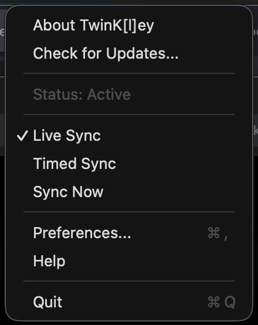
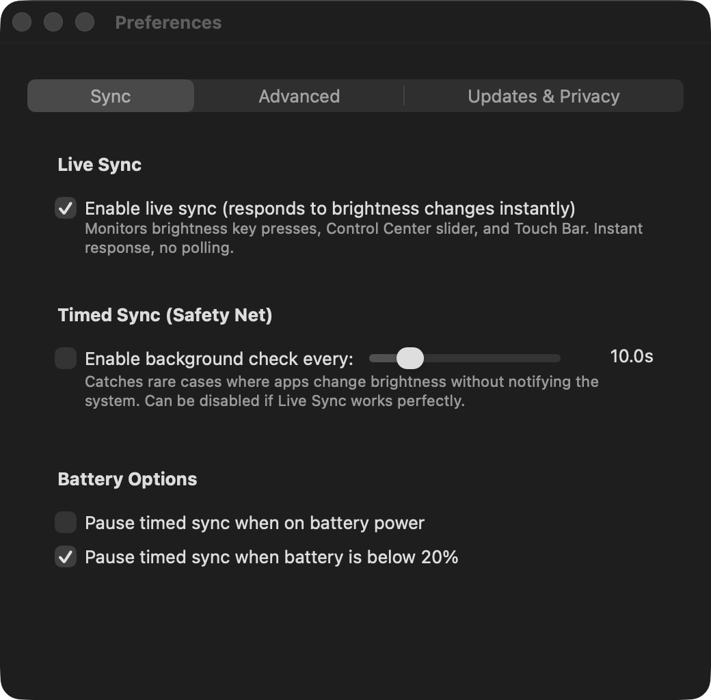
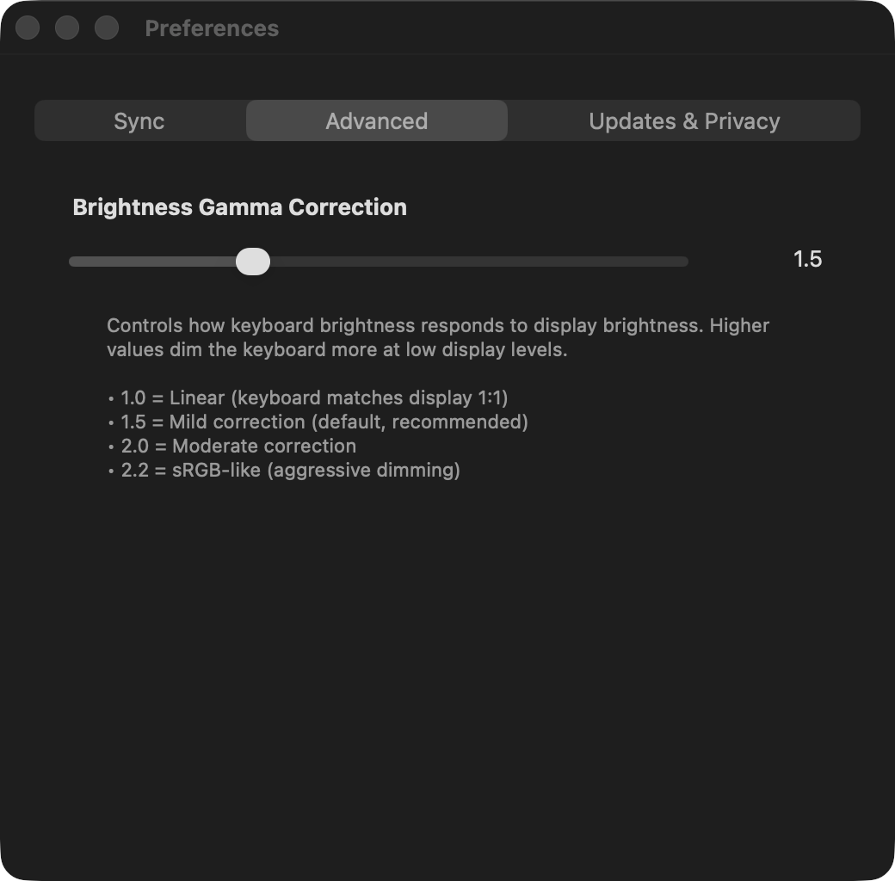
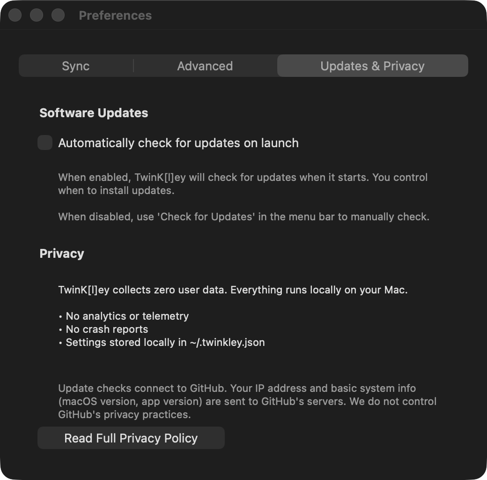
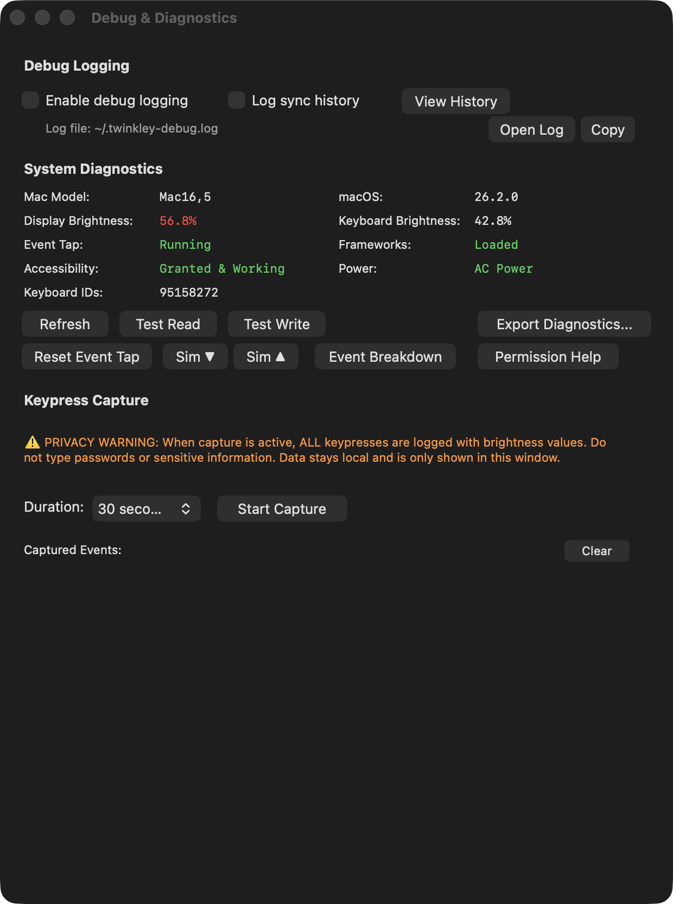

# ☀️ TwinK[l]ey ⌨️

A lightweight macOS menu bar app that synchronizes your keyboard backlight brightness with your display brightness. Designed for M4 MacBook Pro (and other Apple Silicon Macs) where dedicated keyboard brightness keys were removed.

## Features

- **Live Sync**: Instantly syncs when you change brightness (keys, Control Center slider, etc.)
- **Timed Sync**: Optional background check every 10 seconds as a safety net (disabled by default)
- **Battery Aware**: Option to pause background checking when on battery
- **Minimal Resource Usage**: ~11MB memory, zero CPU when idle, runs silently in the menu bar
- **Persistent Settings**: Saves preferences to `~/.twinkley.json`
- **Auto-Updates**: Built-in update system (Sparkle 2) - stay current effortlessly
- **Privacy First**: Zero data collection - everything runs locally ([Privacy Policy](PRIVACY.md))
- **Auto-start**: Optional LaunchAgent for login startup

## Screenshots

### Menu Bar



### Preferences Window - Sync Settings



### Preferences Window - Advanced Settings



### Preferences Window - Updates & Privacy



### Debug Window



### How It Works

TwinKley watches for macOS brightness changes and automatically syncs your keyboard backlight to match.

**Live Sync (Instant)**

When you change your display brightness, macOS sends out an internal "brightness changed" notification. TwinKley listens for these notifications and immediately updates your keyboard backlight. This works with:

- ✅ Brightness keys (Fn+F1/F2 or media keys)
- ✅ Control Center brightness slider
- ✅ Touch Bar brightness controls
- ✅ Automation tools and scripts

This is instant - no waiting, no polling, no battery drain.

**Timed Sync (Safety Net)**

Some apps or tools might change brightness without triggering macOS notifications. The timed sync checks every 10 seconds as a fallback to catch these rare cases. If Live Sync is working perfectly for you, you can disable this in the menu.

**Which should you use?**
- **Live Sync only (default)** - Works for most users with zero battery impact
- **Enable Timed Sync** only if you notice missed syncs when using third-party brightness tools

## Requirements

- macOS (tested on macOS Sequoia with M4 MacBook Pro)
- **Accessibility permissions** (required for keypress detection)

## Installation

### Build from Source

```bash
git clone https://github.com/emrikol/TwinKley.git
cd TwinKley
./build.sh
```

This creates `~/Applications/TwinKley.app` and a LaunchAgent.

### Grant Accessibility Permissions

1. Open **System Settings** > **Privacy & Security** > **Accessibility**
2. Click the **+** button and add `TwinKley.app`
3. Enable the toggle

## Usage

### Start the App

```bash
open ~/Applications/TwinKley.app
```

Or double-click the app in Finder.

### Menu Bar Options

- **About**: Shows app info (double-click icon to toggle debug mode)
- **Check for Updates**: Manually check for new versions
- **Status**: Shows if the app is active
- **Live Sync**: Toggle instant sync (responds to brightness changes immediately)
- **Timed Sync**: Toggle background check every 10 seconds
- **Sync Now**: Manually sync brightness right now
- **Preferences**: Open settings window (⌘,)
- **Help**: Open documentation
- **Quit**: Exit the app

### Auto-start on Login

Enable:
```bash
launchctl load ~/Library/LaunchAgents/com.emrikol.TwinKley.plist
```

Disable:
```bash
launchctl unload ~/Library/LaunchAgents/com.emrikol.TwinKley.plist
```

### Debug Mode

Debug logs are written to `~/.twinkley-debug.log` and include timestamps, brightness events, and sync operations.

**Enable at startup:**
```bash
~/Applications/TwinKley.app/Contents/MacOS/TwinKley --debug
```

**Toggle during runtime (no restart needed):**
1. Click the menu bar icon → "About TwinK[l]ey"
2. Double-click the app icon at the top
3. Debug mode will toggle on/off with a confirmation message

This is useful for diagnosing issues without restarting the app. Perfect for investigating sync problems after sleep/wake cycles or other events.

## Configuration

Settings are stored in `~/.twinkley.json`:

```json
{
  "liveSyncEnabled": true,
  "timedSyncEnabled": true,
  "timedSyncIntervalMs": 10000,
  "pauseTimedSyncOnBattery": false,
  "pauseTimedSyncOnLowBattery": true,
  "brightnessGamma": 1.5
}
```

| Setting | Description | Default |
|---------|-------------|---------|
| `liveSyncEnabled` | Instant sync when brightness changes | `true` |
| `timedSyncEnabled` | Background check every 10s as safety net | `true` |
| `timedSyncIntervalMs` | Polling interval (100-60000ms) | `10000` |
| `pauseTimedSyncOnBattery` | Pause polling when on battery | `false` |
| `pauseTimedSyncOnLowBattery` | Pause polling when battery < 20% | `true` |
| `brightnessGamma` | Gamma correction for brightness curve (0.5-4.0) | `1.5` |

### Advanced Configuration

<details>
<summary><strong>Custom Brightness Key Codes</strong></summary>

TwinKley detects brightness changes by listening for macOS `NX_SYSDEFINED` events with specific key codes. Different Mac models may use different codes:

| Setting | Description | Default |
|---------|-------------|---------|
| `brightnessKeyCodes` | Array of NX key codes to treat as brightness events | `[2, 3, 6, 7]` |

**Default key codes:**
- `2`, `3` - Legacy brightness keys (older Macs)
- `6` - M4 MacBook Pro brightness events
- `7` - Wake/power state brightness events

**When to customize:**
If brightness detection isn't working on your Mac, use the Debug Window's "Capture Events" feature to see which key codes your system generates, then add them to this array.

**Example - adding a custom key code:**
```json
{
  "brightnessKeyCodes": [2, 3, 6, 7, 31]
}
```

*Note: Restart TwinKley after changing this setting.*

</details>

### Brightness Gamma Correction

**TL;DR:** The default gamma of 1.5 dims the keyboard at low display brightness levels. Adjust if needed.

<details>
<summary><strong>Why is this needed?</strong></summary>

Human eyes perceive brightness non-linearly—we're more sensitive to changes in dark tones than bright ones. Without gamma correction, the keyboard may appear too bright or turn off before the display at low brightness levels.

The gamma correction formula applies a power curve:
```
keyboardBrightness = pow(displayBrightness, gamma)
```

**Examples with gamma = 1.5:**
| Display | Keyboard (γ=1.0 linear) | Keyboard (γ=1.5) |
|---------|-------------------------|------------------|
| 100% | 100% | 100% |
| 50% | 50% | 35% |
| 25% | 25% | 12.5% |
| 10% | 10% | 3.2% |
| 6.25% | 6.25% | 1.6% |

**Key findings:**
- Both display and keyboard brightness range from 0.0 (off) to 1.0 (full brightness)
- Physical brightness keys can reach true 0.0 and 1.0
- Gamma values suppress low brightness without creating "sticky zones" where the keyboard turns off before the display

</details>

<details>
<summary><strong>Recommended values</strong></summary>

| Value | Effect |
|-------|--------|
| `1.0` | No correction (linear) - keyboard tracks display 1:1 |
| `1.5` | Mild correction (default) - dims keyboard slightly at low levels |
| `2.0` | Moderate correction - keyboard noticeably dimmer at low levels |
| `2.2` | sRGB-like - aggressive dimming at low brightness |

**Start with `1.5` (default)** and adjust based on preference:
- If keyboard is too bright at low display brightness → increase gamma
- If keyboard turns off before display → decrease gamma
- Lower values = brighter keyboard at low display levels

</details>

<details>
<summary><strong>References</strong></summary>

- [Gamma Correction - Wikipedia](https://en.wikipedia.org/wiki/Gamma_correction) - Background on why displays use gamma curves
- [LED Brightness and Human Perception](https://hackaday.com/2016/08/23/rgb-leds-how-to-master-gamma-and-hue-for-perfect-brightness/) - Why LEDs need gamma correction for perceived linearity

*Note: Apple doesn't publish documentation about keyboard backlight brightness response curves. The 2.2 gamma recommendation is based on standard sRGB gamma and empirical testing.*

</details>

## How It Works

The app uses Apple's private frameworks:
- **CoreBrightness.framework**: `KeyboardBrightnessClient` to control keyboard backlight
- **DisplayServices.framework**: `DisplayServicesGetBrightness` to read display brightness

Brightness change detection uses `CGEventTap` to intercept macOS brightness events (`NX_SYSDEFINED` events).

<details>
<summary><strong>Technical Details: How macOS Brightness Events Work</strong></summary>

**Our Theory (Based on Testing):**

When you change display brightness, macOS posts internal "brightness changed" notifications. We believe this happens AFTER the brightness changes, not as a trigger for the change. Evidence:

| Source | Observed Behavior |
|--------|-------------------|
| **Physical keys** | Generate discrete brightness steps (e.g., 0.5000 → 0.4375 → 0.3750) |
| **Control Center slider** | Generate continuous analog values (e.g., 0.5009 → 0.4910 → 0.3830) |
| **Both** | Post the same event type: `NX_SYSDEFINED` with keyCode=6 (on M4 Macs) |

When you drag the Control Center slider from 0% to 100%, macOS fires multiple `NX_SYSDEFINED` events - one for each brightness level crossed. This is similar to holding down a physical brightness key.

**Why this matters:**
- "Live Sync" isn't just for keypresses - it catches ALL brightness events
- Control Center, Touch Bar, physical keys - all work instantly
- The only time the 10-second timer is needed is for apps that bypass the event system entirely

See `NOTES.md` for full debug logs and detailed investigation.

</details>

## Energy Efficiency

TwinKley is designed to be invisible to your battery. We benchmarked both sync modes over 5 minutes and extrapolated to an 8-hour workday:

| Metric | Live Sync Only | Timed Sync (10s) |
|--------|---------------|------------------|
| **CPU wake-ups (8 hrs)** | **0** | 2,880 |
| **CPU time (8 hrs)** | **~1 second** | ~3 seconds |
| **Memory** | 10.7 MB | 10.8 MB |

### What This Means

**Live Sync** is truly event-driven. The app sleeps until macOS sends a brightness change notification, then wakes briefly to sync and immediately sleeps again. During our 5-minute benchmark, Live Sync caused **zero** CPU wake-ups.

**Timed Sync** polls every 10 seconds as a fallback. Over an 8-hour workday, that's 2,880 timer fires—each one briefly waking the CPU. While each wake-up is tiny (~0.001s), they add up and prevent the CPU from entering deeper sleep states.

### Recommendation

- **Use Live Sync only** (default) for best battery life
- **Enable Timed Sync** only if you use third-party tools that change brightness without triggering system events

### Run Your Own Benchmark

```bash
# 5 minutes per mode (10 min total)
./scripts/benchmark-sync-modes.sh

# Custom duration (e.g., 60 seconds per mode)
./scripts/benchmark-sync-modes.sh 60
```

## Troubleshooting

<details>
<summary><strong>Brightness keys not detected after rebuild/update</strong></summary>

macOS caches code signing information in the TCC (Transparency, Consent, and Control) database. If you rebuild TwinKley or the code signature changes, the cached permission may become stale.

**Fix:** Toggle Accessibility permission off and on:
1. Open **System Settings** → **Privacy & Security** → **Accessibility**
2. Find TwinKley and turn it **OFF**
3. Turn it back **ON**
4. Restart TwinKley

This refreshes the code signing validation in the TCC database.

</details>

<details>
<summary><strong>Debug brightness detection issues</strong></summary>

1. Enable debug mode (double-click the icon in About dialog)
2. Open the Debug Window from the menu bar
3. Click "Capture Events" and press brightness keys
4. Check which key codes are generated
5. Add any missing codes to `brightnessKeyCodes` in `~/.twinkley.json`

</details>

## Technical Notes

- M4 MacBooks use `keyCode=6` or `keyCode=7` for display brightness events (different from older Macs which use codes 2/3)
- The app requires Accessibility permissions for the event tap to function
- See `NOTES.md` for detailed research notes on the implementation

## Privacy

**TwinKley collects zero user data.** Everything runs locally on your Mac.

- ❌ No analytics or telemetry
- ❌ No crash reports
- ❌ No network connections (except update checks)
- ✅ Settings stored locally in `~/.twinkley.json`
- ✅ Optional debug logs in `~/.twinkley-debug.log`

Auto-updates use Sparkle framework and only transmit: app version, macOS version, and CPU architecture. No personally identifiable information.

**Read our full [Privacy Policy](PRIVACY.md)** for complete details.

## License

This project is licensed under the GNU General Public License v3.0 - see the [LICENSE](LICENSE) file for details.

## Support Policy

**This software is provided as-is with no support.**

- ✅ You may use, modify, and redistribute it freely under the GPL-3.0 license
- ❌ **No support, bug fixes, or feature requests accepted**
- ❌ **Issues are disabled** - Please do not contact the maintainer for help
- ❌ **Pull requests accepted only from collaborators**
- 💡 **For modifications, please fork** and rename to avoid confusion

### Why This Policy?

TwinK[l]ey uses private macOS frameworks (`CoreBrightness.framework`, `DisplayServices.framework`) that may break in future OS updates. It's designed for M4 MacBook Pro but may work on other Apple Silicon Macs. Supporting all hardware/software combinations is beyond the scope of this project.

**If it works for you: great! If not: please fork it and adapt it to your needs.**

### For Forkers

If you fork and redistribute modified versions:
- Please use a **different project name and branding** to avoid confusion
- You must comply with the GPL-3.0 license terms (share source, same license)
- No attribution to the original maintainer is implied for forks

## Acknowledgments

- [KBPulse](https://github.com/EthanRDoesMC/KBPulse) - For the KeyboardBrightnessClient approach
